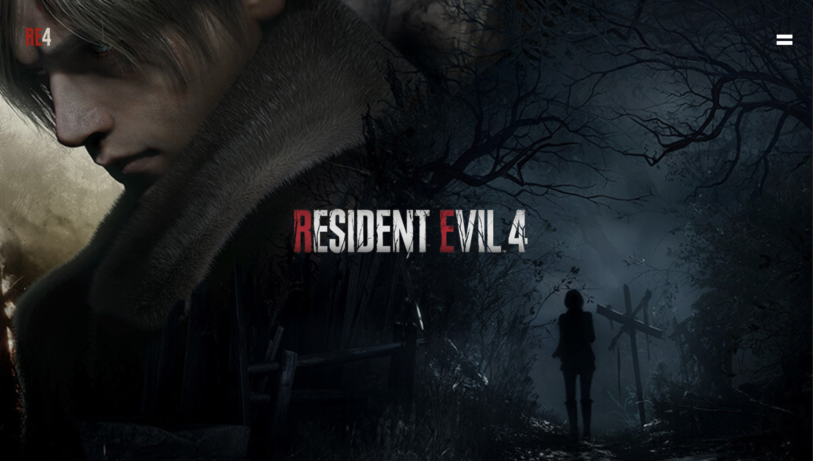
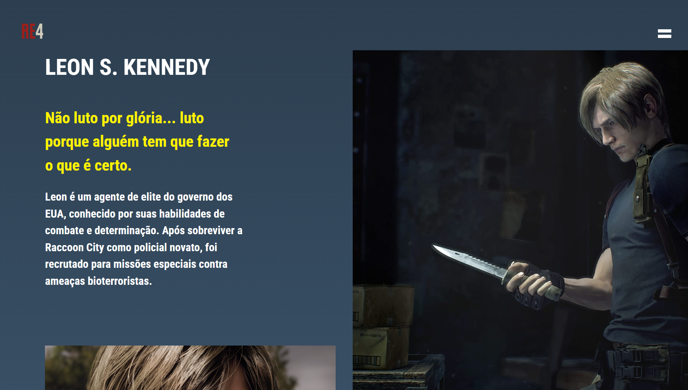
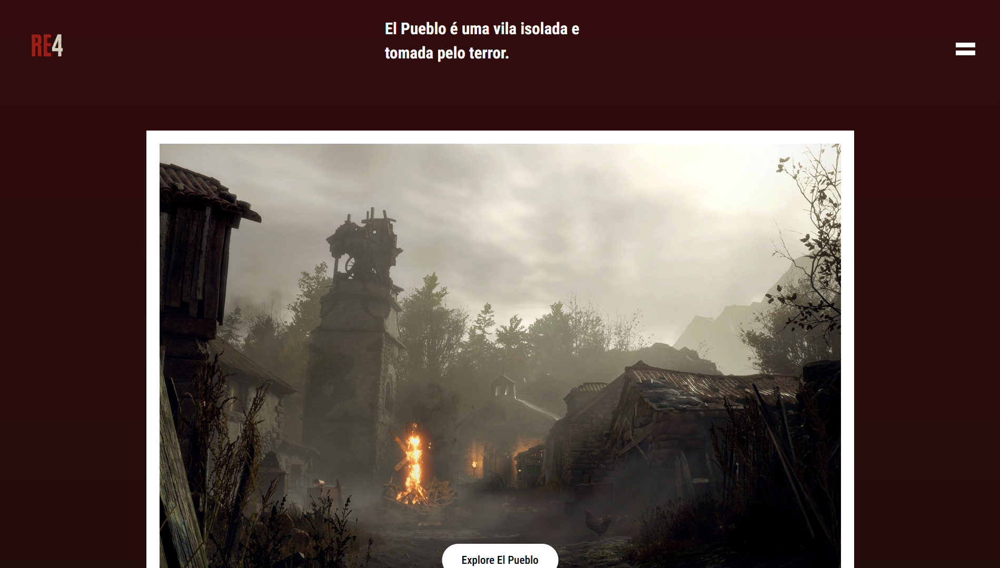
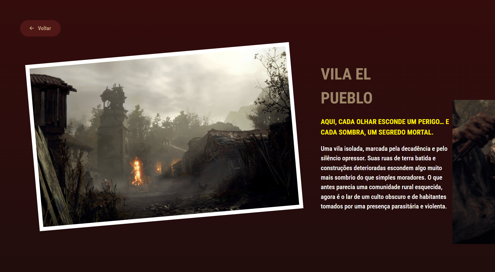
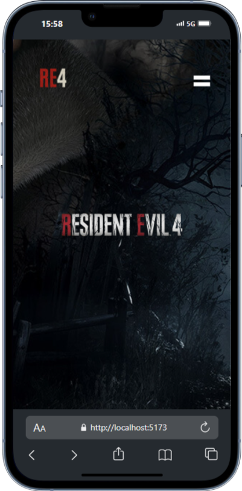
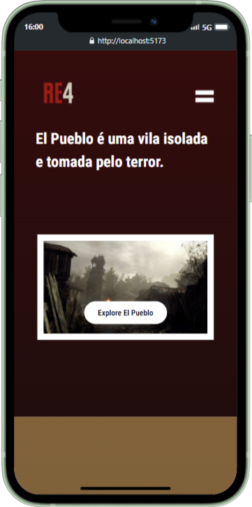
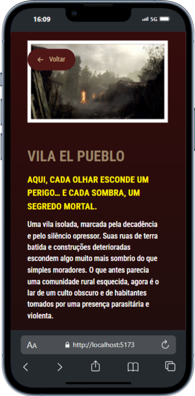

# Resident Evil 4

Este é um projeto de estudo pessoal inspirado no universo do **Resident Evil 4 Remake**, criado com o objetivo de praticar desenvolvimento web utilizando tecnologias como **React**, **Tailwind CSS**, **React Router DOM**, **Context API**, e **Vite**.

A aplicação funciona como uma **galeria interativa** com informações sobre personagens, locais e artes visuais do jogo.

## 🧪 Tecnologias Utilizadas
- ⚛️ **React**
Biblioteca JavaScript para construção de interfaces de usuário reutilizáveis. Utilizada para criar os componentes e o fluxo da aplicação.

- 🌬️ **Tailwind CSS**
Framework CSS utilitário que permite estilizar os componentes diretamente nas classes, facilitando a criação de layouts modernos e responsivos.

- 🧭 **React Router DOM**
Biblioteca de roteamento para React. Usada para controlar as rotas da aplicação (como páginas de personagens, locais, etc.) sem recarregar a página.

- 🧠 **Context API (React)**
Ferramenta nativa do React usada para gerenciar estados globais entre componentes. Utilizada no projeto para controlar dados compartilhados como estado de modais, tema, ou dados selecionados.

- ⚡ **Vite**
Build tool moderna e super rápida. Utilizada para rodar o projeto em modo de desenvolvimento e gerar a versão final otimizada para produção.

## ⚙️ Como Rodar o Projeto

### 1. Clone este repositório
```bash
git clone https://github.com/gustavo-gsilva/resident-evil-4.git
```

### 2. Acesse a pasta do projeto
```bash
cd resident-evil-4
```

### 3. Instale as dependências
```bash
npm install
```

### 4. Inicie o servidor de desenvolvimento
```bash
npm run dev
```

## 🚀 Funcionalidades

- 📸 **Visualização de Imagens**
Permite navegar por imagens dos personagens, cenários e artworks oficiais do Resident Evil 4 Remake.

- 🧍‍♂️ **Perfis dos Personagens**
Exibe descrições detalhadas de cada personagem principal, com informações sobre suas histórias, características e papel no jogo.

- 🏰 **Exploração dos Locais**
Apresenta os principais cenários do jogo, com imagens e descrições dos ambientes como o vilarejo, castelo e a ilha.

- 🔄 **Navegação Intuitiva**
Uso do React Router DOM para navegar facilmente entre locais e galerias sem recarregar a página.

## 📸 Demonstração

- **Screenshots versão desktop**  
  
  
  

  

  

  

  - **Screenshots versão mobile**  
  

  

  

  